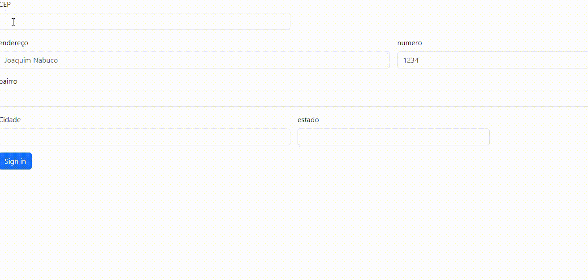
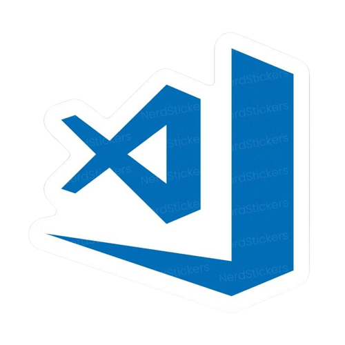
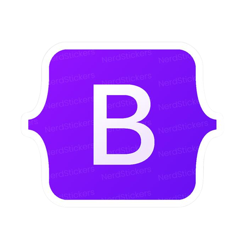

[projeto-CadEndereco](#projeto-cadendereco)

[descrição](#--descri%C3%A7%C3%A3o)

# projeto-CadEndereco
 pelo que da pra ver a pagina funciona como uma tela de cadastro de endereço, pra comecar pegamos boa parte do codigo no bootstrap, depois fomos fazendo mudanças simples como traduzir TUDO para o portuges, e apagar partes do coigo que nos não vamos usar.

 ##  descrição
 como eu disse antes, a pagina e como se fosse uma tela de cadastro de confirmação de endereço.
 ## funcionalidade
o codigo serve especificamente para marcar seu endereço para os correios, por exemplo:rua bairro  numero e etc.
 
## tecnologias utilizadas

